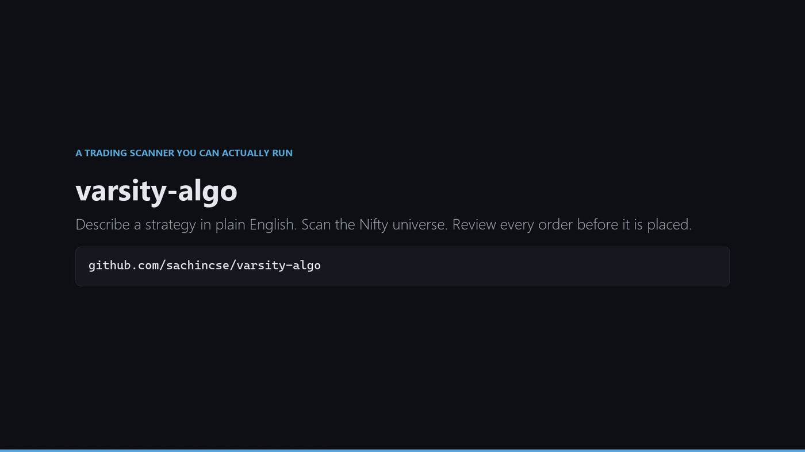
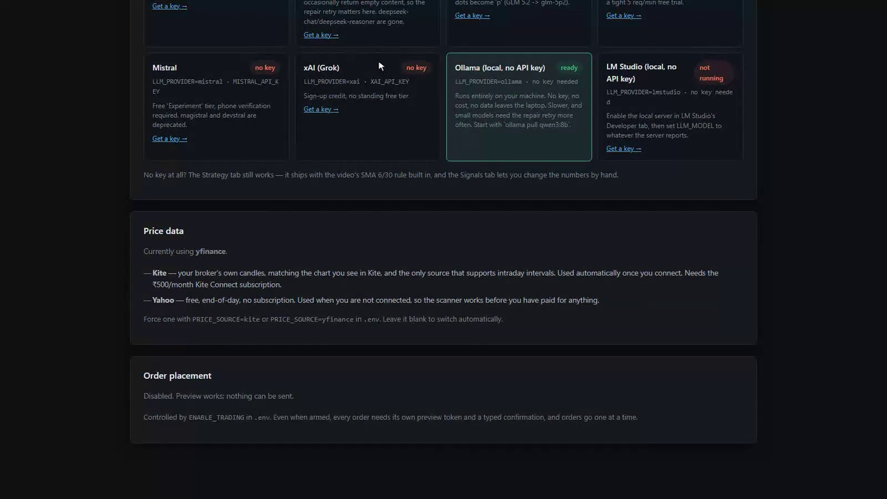
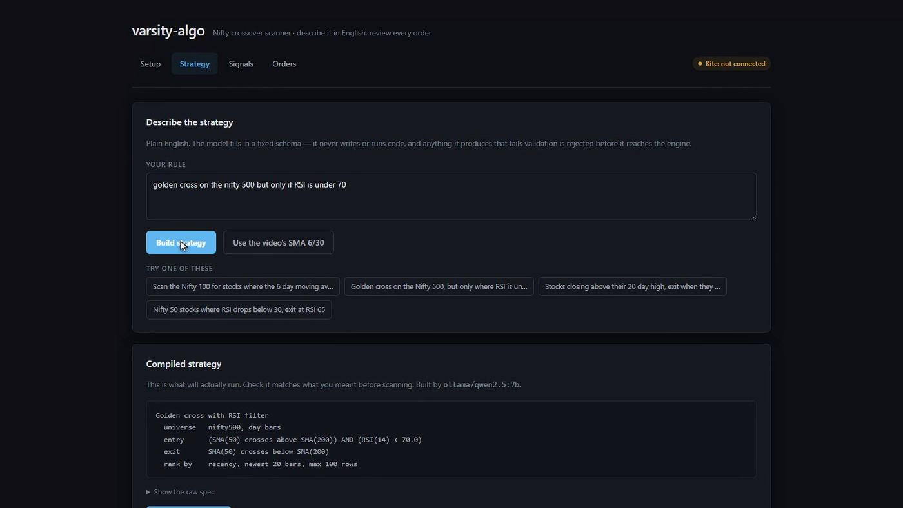
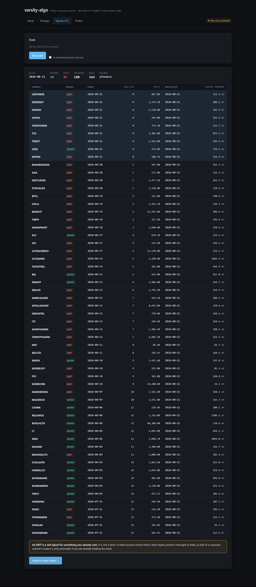
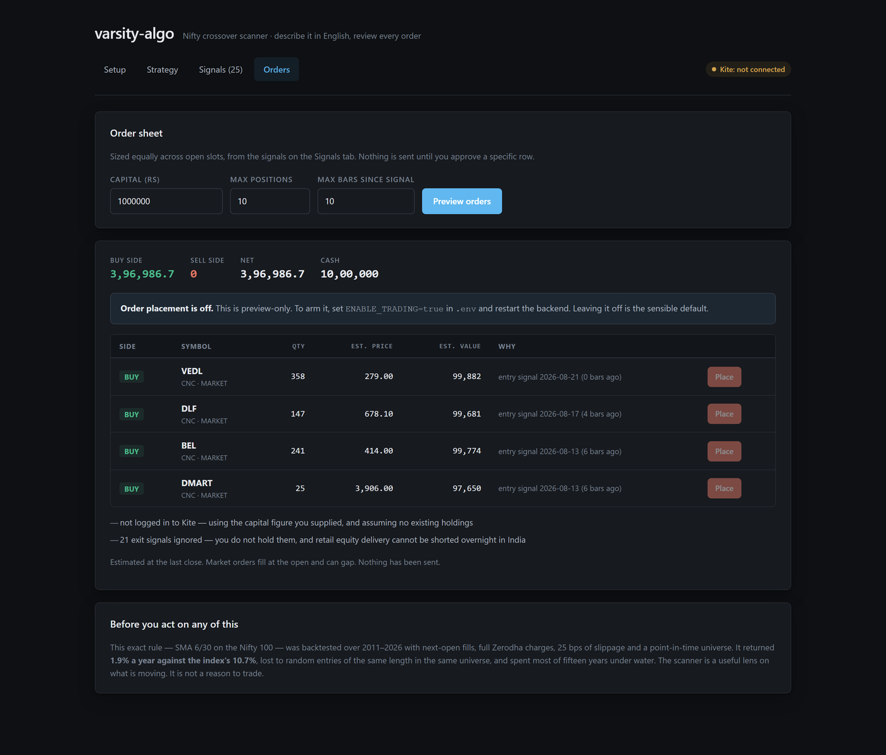

# varsity-algo

[](https://github.com/sachincse/varsity-algo/actions/workflows/ci.yml)
[](LICENSE)
[](https://www.python.org/downloads/)

A trading-signal scanner for the Indian market that you can actually run.
Describe a strategy in plain English, scan the Nifty universe, and review every
order before it is placed.

This is the system from Zerodha Varsity's
[*Build a Trading Algo with AI — No Coding Required*](https://www.youtube.com/watch?v=V9Ra8klDzrM),
built end to end and built safely.

**No API keys needed to scan.** Zerodha is optional. The language model is
optional, and can run entirely on your own laptop for free.

---

## Watch the setup tutorial

[](https://github.com/sachincse/varsity-algo/releases/latest)

**▶ [Download the tutorial (4 min, narrated)](https://github.com/sachincse/varsity-algo/releases/latest)**
— or [docs/varsity-algo-tutorial.mp4](docs/varsity-algo-tutorial.mp4) in the repo.

Install, first scan, building a strategy from English, and the order
guardrails. Narrated end to end. Every frame is the real application — the
strategy you see being built from *"golden cross on the nifty 500 but only if
RSI is under 70"* was produced live by a 7B model running locally with no API
key.

---

## Install

**Windows** — download the repo, then double-click **`start.bat`**.

**macOS / Linux**

```bash
git clone https://github.com/sachincse/varsity-algo
cd varsity-algo
chmod +x start.sh && ./start.sh
```

That is the whole thing. The script checks for Python and Node, creates a
virtual environment, installs everything, builds the dashboard, and opens
<http://localhost:8000>. Re-running it is fast.

You need [Python 3.11+](https://www.python.org/downloads/) (tick **"Add
python.exe to PATH"** on the first installer screen) and
[Node 20.19+ or 22.12+](https://nodejs.org/). If Node is missing the app still
runs — you just get the API instead of the dashboard.

Full walkthrough, including every error message and its fix:
**[docs/SETUP.md](docs/SETUP.md)**.

---

## What it does

| | |
|---|---|
|  | **Setup** — every language-model option and whether it is ready. Green means usable right now. Connect Zerodha here if you want holdings and live prices. |
|  | **Strategy** — type the rule the way you would say it. The model fills a fixed schema; it never writes or runs code. |
|  | **Signals** — the ranked crossover table, with a progress bar on the first (slow) scan and an honest count of anything not shown. |
|  | **Orders** — signals become a sized order sheet. Placement is off by default and every order needs its own confirmation. |

---

## The language model is optional, and free

Only used to turn English into a strategy. Pick one, put it in `.env`, restart.

**Free, no credit card**

| Provider | `.env` | Get a key |
|---|---|---|
| Groq | `LLM_PROVIDER=groq`<br>`GROQ_API_KEY=…` | [console.groq.com/keys](https://console.groq.com/keys) |
| Google Gemini | `LLM_PROVIDER=gemini`<br>`GEMINI_API_KEY=…` | [aistudio.google.com/apikey](https://aistudio.google.com/apikey) |
| OpenRouter | `LLM_PROVIDER=openrouter`<br>`OPENROUTER_API_KEY=…` | [openrouter.ai/keys](https://openrouter.ai/keys) |

**Free and fully offline — no key, no account, nothing leaves your machine**

```bash
# install from https://ollama.com/download
ollama pull qwen3:8b
```

```ini
LLM_PROVIDER=ollama
LLM_MODEL=qwen3:8b
```

The tutorial video was recorded this way. A 7B model handled *"golden cross on
the nifty 500 but only if RSI is under 70"* correctly, on a laptop, for nothing.

Twelve providers are supported in total — Anthropic, Groq, OpenRouter, Gemini,
Together, DeepSeek, Fireworks, Cerebras, Mistral, xAI, Ollama, LM Studio, plus
any OpenAI-compatible endpoint. Claude uses its official SDK; the rest share one
adapter.

> Model IDs rot fast. Groq retired every Llama chat model in August 2026. If you
> see *"provider does not know this model"*, set `LLM_MODEL` to a current one —
> no code change needed.

---

## What is different from the video

**The AI writes code and then runs it.** A model that can emit arbitrary Python
into a process holding your broker access token is a remote-code-execution path
with a natural-language prompt as its input. Here the model fills a closed
schema ([`core/nl.py`](core/nl.py)) which compiles into a validated strategy
([`core/spec.py`](core/spec.py)). Asking it to add a `shell_command` field
returns `Extra inputs are not permitted`.

**₹500/month before you can look at anything.** The scanner runs on free
end-of-day data. Kite Connect is optional.

**Nothing checks the signals are honest.** 44 tests, and the important ones try
to prove the engine cannot see the future: truncate the input and signals must
be unchanged; replace every bar after date *T* with noise and everything up to
*T* must be bit-identical.

**Bullish and bearish are presented symmetrically.** A retail account cannot
hold a short equity position overnight in India, so a bearish crossover is an
exit for something you already own, never a trade.

---

## Does the strategy make money?

No, and you should know that before building on it. SMA(6)/SMA(30) on the Nifty
100, 2011–2026, next-open fills, full Zerodha charges, 25 bps slippage, and a
point-in-time universe:

| | CAGR |
|---|---|
| SMA 6/30, honestly tested | **1.92%** |
| Nifty 100 total-return index, net of fees | **10.70%** |
| Same universe, no timing rule at all | 11.90% |

It also sits at the **28th percentile** of a random-entry null with the same
trade count and holding periods. 95% of gross trading gains went to charges, and
67% of the remaining profit was dividends the strategy did nothing to earn.

The scanner is a useful lens on what is moving. It is not a reason to trade.

---

## Safety model for orders

Placing an order is the only irreversible thing this program does, so it sits
behind four locks:

1. `ENABLE_TRADING=true` in `.env` — a deliberate act in a text editor
2. a preview that mints a one-time token bound to the exact symbol, side,
   quantity and product
3. that token expiring after three minutes, because the prices behind it go stale
4. a browser confirmation naming the order

Orders go one at a time. There is no "place all".

---

## Layout

```
core/     spec.py (the DSL) · nl.py (English → spec) · engine.py (causal
          indicators) · data.py (yfinance or Kite)
server/   FastAPI; serves /api and the built SPA from one process
          kite_client.py · jobs.py · llm/ (12 providers) · routes/
web/      React + Vite dashboard
tests/    44 tests, mostly attempts to break the causality guarantee
tools/    record_app.py · narration.py · build_video.py — the tutorial
          video is generated from source, not hand-edited
docs/     SETUP.md · API_SPEC.md · the tutorial video
```

## Development

```bash
python -m pytest tests/ -q          # 44 passed
cd web && npm run dev               # hot-reload frontend on :5173
python -m uvicorn server.main:app --reload --port 8000
```

Rebuild the tutorial video (needs ffmpeg):

```bash
python tools/record_app.py --out build/clips   # drive the real app
python tools/build_video.py --revoice          # narrate, edit, encode
```

The narration script lives in [`tools/narration.py`](tools/narration.py) and is
spoken by a free neural voice via `edge-tts` — no API key. Narration *drives*
the edit: each segment is stretched to fit its line rather than the line being
squeezed into a duration chosen in advance. Change `VOICE` for a different
accent.

## Licence

MIT — see [LICENSE](LICENSE). Not financial advice. You are responsible for
every order you approve.
